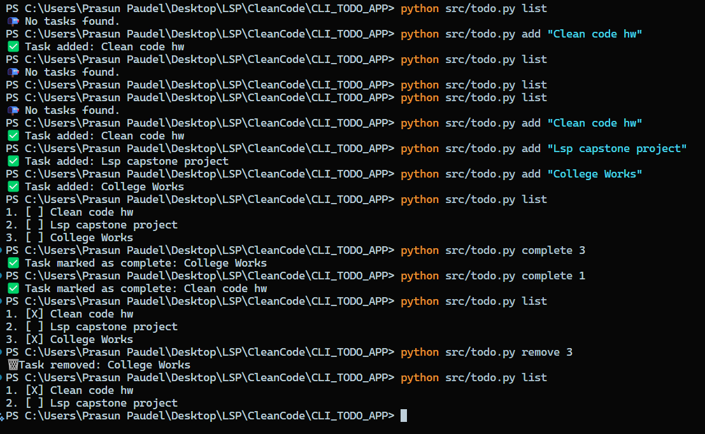
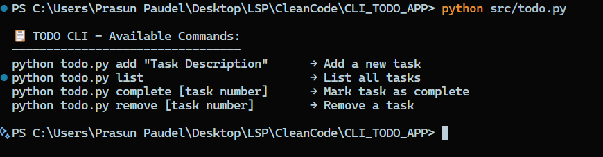

Your README is already excellent in terms of structure and content. Below is a visually enhanced version of it **without changing any content**, just improving spacing, consistency, and GitHub rendering:

---

```markdown
# 📝 CLI Todo App (Python)

A simple and clean **Command-Line Interface (CLI) Todo application** built with Python. It allows you to manage tasks directly from your terminal with **Clean Code principles** in mind.

---

## ✅ Features

- 📌 Add new todo tasks
- 📋 List all current tasks with status
- ✅ Mark tasks as completed
- 🗑️ Remove tasks
- 💾 Persist data using a JSON file
- 🧼 Clean, modular, readable Python code

---

## 📁 Project Structure
```

CLI_TODO_APP/
├── assets/
├── data/
│ └── tasks.json # Stores tasks persistently
├── src/
│ └── todo.py # Main CLI app
└── README.md # Project documentation

````

---

## 🚀 How to Run

Navigate to the root of the project and run:

```bash
python src/todo.py [command]
````

---

## 💡 Available Commands

| Command                  | Description                    |
| ------------------------ | ------------------------------ |
| `add "Task Description"` | Add a new task                 |
| `list`                   | List all tasks                 |
| `complete <task_number>` | Mark a task as complete        |
| `remove <task_number>`   | Remove a task                  |
| _(no command)_           | Show help / usage instructions |

---

## 📌 Example Usage

```bash
$ python src/todo.py add "Finish Clean Code assignment"
✅ Task added: Finish Clean Code assignment

$ python src/todo.py list
1. [ ] Finish Clean Code assignment

$ python src/todo.py complete 1
✅ Task marked as complete: Finish Clean Code assignment

$ python src/todo.py list
1. [X] Finish Clean Code assignment

$ python src/todo.py remove 1
🗑️ Task removed: Finish Clean Code assignment
```

---

### ➕ Adding and Listing Tasks

```bash
$ python src/todo.py add "Buy groceries"
✅ Task added: Buy groceries

$ python src/todo.py list
1. [ ] Buy groceries
```

### ✅ Completing Tasks

```bash
$ python src/todo.py complete 1
✅ Task marked as complete: Buy groceries

$ python src/todo.py list
1. [X] Buy groceries
```

---

## 🧼 Clean Code Principles Applied

| Principle                 | How It’s Followed                                         |
| ------------------------- | --------------------------------------------------------- |
| **Single Responsibility** | Each function does one thing only                         |
| **Meaningful Naming**     | Functions and variables are self-descriptive              |
| **Short Functions**       | No long blocks; small reusable functions                  |
| **Error Handling**        | Invalid inputs and file issues handled gracefully         |
| **Consistency**           | Indentation, casing, and formatting are clean and uniform |

---

## 📦 Data Storage

Tasks are stored in `data/tasks.json` as:

```json
[
  { "task": "Buy groceries", "completed": false },
  { "task": "Call mom", "completed": true }
]
```

````

---

### 📸 How to Add Images in GitHub Markdown (from VS Code)

1. **Put image in your repo**
   Save your image (e.g., `screenshot.png`) in a folder like `assets/` inside your project directory.

2. **Reference it in the README**
   Add this markdown line where you want to show the image:

   ```markdown
   
````

Example:

```markdown
## 🖼️ Screenshot



```
